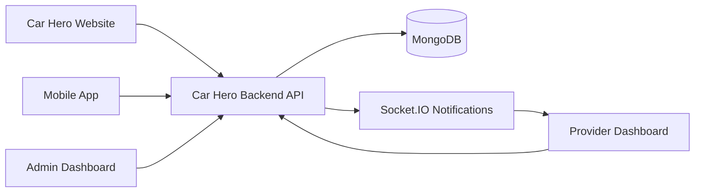
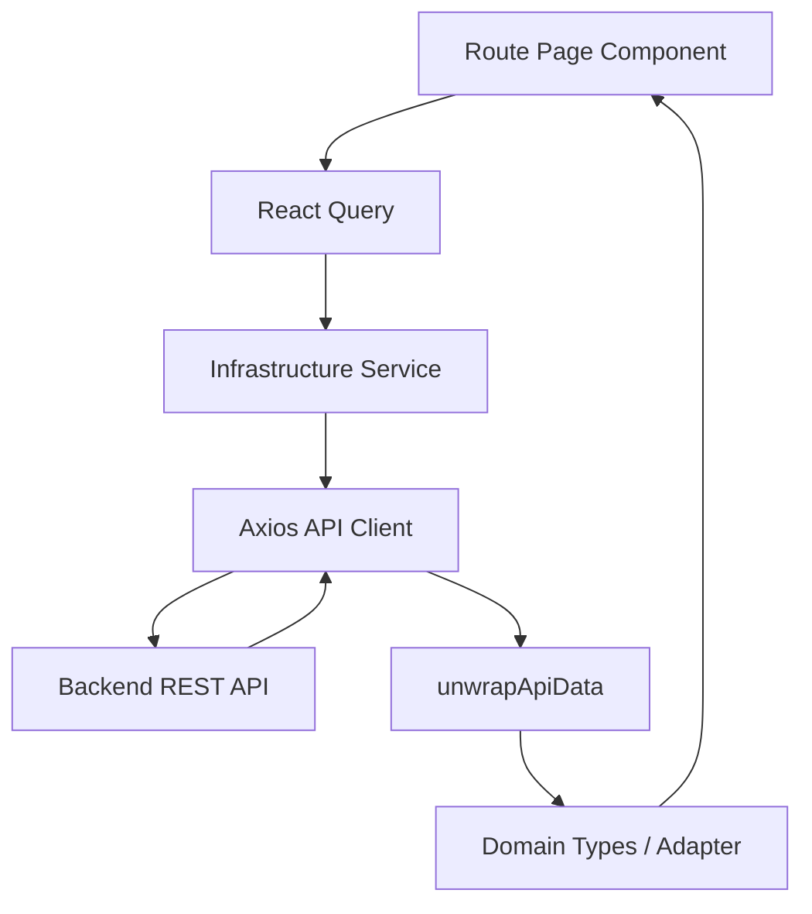
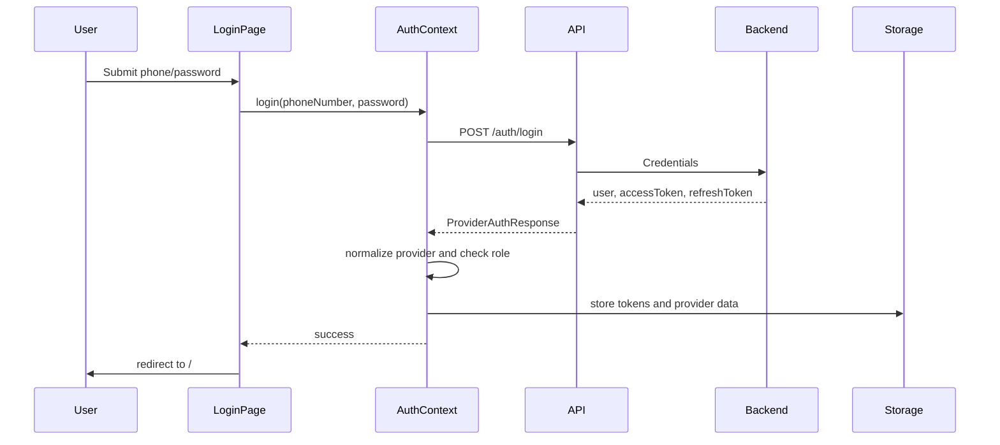
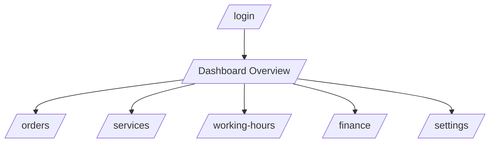
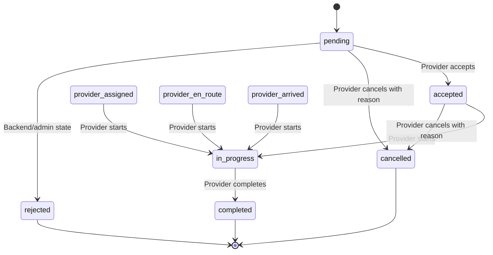
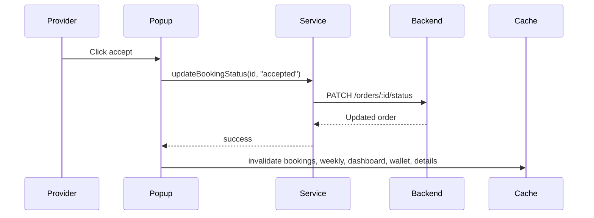
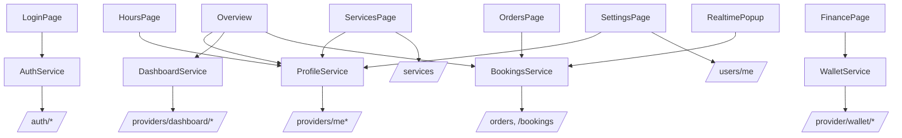

# CAR_HERO_PROVIDER_DASHBOARD Technical and Functional Documentation

Definitive technical, functional, architectural, and operational reference for the Car Hero Provider Dashboard.

This document is based on the actual source code of `car-hero-provider-dashboard`. It documents implemented behavior only. When an expected product module is not present in the codebase, this document states that explicitly instead of inventing behavior.

All source paths are relative to `car-hero-provider-dashboard/`.

---

## Table of Contents

1. [Dashboard Overview](#1-dashboard-overview)
2. [Technology Stack](#2-technology-stack)
3. [Project Structure](#3-project-structure)
4. [Dashboard Architecture](#4-dashboard-architecture)
5. [Authentication & Access Control](#5-authentication--access-control)
6. [Navigation System](#6-navigation-system)
7. [Pages Documentation](#7-pages-documentation)
8. [Provider Profile Module](#8-provider-profile-module)
9. [Services Management Module](#9-services-management-module)
10. [Working Hours Module](#10-working-hours-module)
11. [Orders Management Module](#11-orders-management-module)
12. [Order Processing Workflow](#12-order-processing-workflow)
13. [Earnings & Revenue Module](#13-earnings--revenue-module)
14. [Wallet Module](#14-wallet-module)
15. [Reviews & Ratings Module](#15-reviews--ratings-module)
16. [Analytics & Statistics Module](#16-analytics--statistics-module)
17. [Notifications Module](#17-notifications-module)
18. [Messaging & Communication Module](#18-messaging--communication-module)
19. [Subscription Module](#19-subscription-module)
20. [Provider Performance Metrics](#20-provider-performance-metrics)
21. [API Integrations](#21-api-integrations)
22. [State Management](#22-state-management)
23. [Forms System](#23-forms-system)
24. [Search, Filter & Sorting Systems](#24-search-filter--sorting-systems)
25. [Design System](#25-design-system)
26. [Performance Optimization](#26-performance-optimization)
27. [Error Handling](#27-error-handling)
28. [Environment Configuration](#28-environment-configuration)
29. [Security Considerations](#29-security-considerations)
30. [Complete Feature Inventory](#30-complete-feature-inventory)
31. [Provider User Guide](#31-provider-user-guide)
32. [Known Limitations](#32-known-limitations)
33. [How CAR_HERO_PROVIDER_DASHBOARD Works Internally](#33-how-car_hero_provider_dashboard-works-internally)

---

## 1. Dashboard Overview

### Purpose

`CAR_HERO_PROVIDER_DASHBOARD` is a web dashboard for Car Hero service providers. It lets a provider log in, monitor business performance, manage service offerings, configure working hours, process orders, upload verification documents, review financial data, request payouts, and receive real-time order notifications.

### Business Goals

The dashboard supports the provider side of the marketplace by:

- Giving providers visibility into active, scheduled, completed, cancelled, and rejected orders.
- Allowing providers to accept, start, complete, or cancel orders.
- Letting providers maintain services, prices, and availability.
- Letting providers define weekly availability.
- Displaying revenue, wallet balance, transactions, and payout actions.
- Displaying verification status and document upload tools.
- Receiving real-time order notifications over Socket.IO.

### Target User

The direct user is a Car Hero service provider or provider operator. The dashboard assumes the provider account already exists in the backend. It does not contain a full provider signup flow.

### Position in the Car Hero Ecosystem



### Relationship With Other Systems

| System | Relationship |
|---|---|
| Backend | Primary data source. All provider profile, services, orders, wallet, dashboard stats, auth, and document upload actions go through backend HTTP endpoints. |
| Database | Not accessed directly by the dashboard. Data is read/written through backend API endpoints. |
| Website | Public/customer web side of the ecosystem. Provider dashboard does not directly call the website. |
| Mobile App | Customer-facing app likely creates orders that providers process here. The dashboard does not directly call the mobile app. |
| Admin Dashboard | Admins approve/reject providers and may review payout requests. Provider dashboard reflects those decisions through provider status and wallet endpoints. |

### Provider Lifecycle Inside This Dashboard

The implemented dashboard lifecycle is:

1. Provider logs in with phone number and password.
2. Dashboard stores provider tokens and provider profile locally.
3. Protected shell loads provider profile and route-specific data.
4. Provider reviews verification status.
5. Provider uploads or removes documents.
6. Provider configures services, prices, and availability.
7. Provider configures weekly working hours.
8. Provider receives order notifications and manages order statuses.
9. Provider tracks revenue, wallet balance, transactions, and payout requests.
10. Provider updates notification preferences or logs out.

Provider account creation, OTP verification, subscription buying, chat, and full review management are not implemented in this dashboard source.

---

## 2. Technology Stack

| Technology | Used For | Where It Appears | Responsibility |
|---|---|---|---|
| Next.js 16.2.6 | App framework | `src/app`, `next.config.ts` | App Router, layouts, route groups, middleware-like proxy, build/runtime. |
| React 19.2.4 | UI runtime | All `*.tsx` components | Client components, state, effects, forms, dialogs. |
| TypeScript 5 | Type safety | `tsconfig.json`, `src/domain`, services | Domain entities, service contracts, component props. |
| Tailwind CSS 4 | Styling | `src/app/globals.css`, component classes | Utility styling, CSS variables, responsive layout. |
| tw-animate-css | Animations | `src/app/globals.css` | Animation utilities imported globally. |
| Base UI React | Primitive UI behavior | `src/components/ui/button.tsx`, `dialog.tsx`, `switch.tsx`, etc. | Accessible primitives wrapped by local UI components. |
| class-variance-authority | Variants | `src/components/ui/button.tsx` | Button style variants and sizes. |
| lucide-react | Icons | Layout, cards, buttons, pages | Consistent iconography across navigation and actions. |
| TanStack React Query v5 | Server state | `src/components/providers.tsx`, pages | Fetching, caching, invalidation, prefetching, mutations. |
| Axios | HTTP client | `src/infrastructure/api/client.ts`, services | API base URL, auth header injection, refresh-token interceptor. |
| socket.io-client | Realtime notifications | `src/application/hooks/use-socket.ts` | Connects to `/notifications` namespace and receives order events. |
| ECharts + echarts-for-react | Charts | Overview, orders, finance components | Revenue, status, service performance, weekly, transaction charts. |
| Sonner | Toast notifications | `src/components/providers.tsx`, pages | Success/error/loading toasts. |
| date-fns | Date formatting | Orders, finance, overview | Relative dates and localized labels. |
| clsx + tailwind-merge | Class merging | `src/lib/utils.ts` | Safe conditional Tailwind class composition. |
| Vitest | Unit tests | `src/infrastructure/services/*.test.ts` | Service-level tests for auth, bookings, wallet. |
| ESLint 9 + Next config | Linting | `eslint.config.mjs` | Code quality checks. |

### Libraries Not Present

The current codebase does not use:

- A form library such as React Hook Form.
- A schema validation library such as Zod or Yup.
- A table/grid library.
- A global state store such as Redux, Zustand, or Jotai.
- A map rendering library. Order cards only generate external Google Maps links from coordinates.

---

## 3. Project Structure

### Architecture Tree

```text
car-hero-provider-dashboard/
  .env.local
  components.json
  eslint.config.mjs
  next.config.ts
  package.json
  package-lock.json
  postcss.config.mjs
  tsconfig.json
  vitest.config.ts
  public/
    logo_carHero.png
  scripts/
    # Empty in the inspected project
  src/
    app/
      layout.tsx
      globals.css
      favicon.ico
      login/
        page.tsx
      (dashboard)/
        layout.tsx
        page.tsx
        components/
        orders/
        services/
        working-hours/
        finance/
        settings/
    application/
      contexts/
        auth-context.tsx
      hooks/
        use-client-ready.ts
        use-socket.ts
      services/
        prefetch.ts
    components/
      providers.tsx
      layout/
        header.tsx
        sidebar.tsx
      providers/
        notification-alert-provider.tsx
      ui/
        avatar.tsx
        badge.tsx
        button.tsx
        card.tsx
        dialog.tsx
        input.tsx
        label.tsx
        skeleton.tsx
        sonner.tsx
        stat-card.tsx
        switch.tsx
        textarea.tsx
    domain/
      entities/
        auth.types.ts
        booking.types.ts
        dashboard.types.ts
        provider.types.ts
        wallet.types.ts
    infrastructure/
      adapters/
        booking.adapter.ts
      api/
        client.ts
        types.ts
        unwrap.ts
      auth/
        session.ts
      services/
        auth.service.ts
        bookings.service.ts
        dashboard.service.ts
        profile.service.ts
        wallet.service.ts
        *.test.ts
    lib/
      utils.ts
    proxy.ts
```

### Major Folders

| Folder | Responsibility |
|---|---|
| `src/app` | Next.js App Router routes, global layout, global CSS, login, and authenticated dashboard route group. |
| `src/app/(dashboard)` | Provider-authenticated dashboard pages and page-specific components. |
| `src/application` | Application-level concerns: auth context, socket hook, client-ready hook, query key and prefetch policy. |
| `src/components` | Shared UI, shell layout, global providers, realtime notification provider. |
| `src/domain/entities` | TypeScript domain models for auth, provider, booking, dashboard stats, and wallet. |
| `src/infrastructure/api` | Axios client, API envelope types, unwrapping helper. |
| `src/infrastructure/auth` | Local session persistence and client-side cookie handling. |
| `src/infrastructure/services` | HTTP service modules used by pages and hooks. |
| `src/infrastructure/adapters` | DTO normalization. Only booking normalization exists here. |
| `src/lib` | Shared utility helpers. |
| `public` | Static assets. Currently contains `logo_carHero.png`. |
| `scripts` | Present but empty in the inspected project. |

### Important Files

| File | Responsibility |
|---|---|
| `src/proxy.ts` | Route protection using provider access token cookie. |
| `src/components/providers.tsx` | Creates React Query client, AuthProvider, and Sonner toaster. |
| `src/application/contexts/auth-context.tsx` | Login/logout state and provider session lifecycle. |
| `src/infrastructure/api/client.ts` | Axios base URL, auth header, refresh-token response interceptor. |
| `src/infrastructure/auth/session.ts` | LocalStorage token/provider persistence and access-token cookie. |
| `src/application/services/prefetch.ts` | Unified provider query keys and route prefetch functions. |
| `src/components/providers/notification-alert-provider.tsx` | Realtime order popup, accept/decline actions, sound, cache invalidation. |
| `src/app/(dashboard)/layout.tsx` | Authenticated shell with sidebar, header, realtime provider. |
| `src/app/(dashboard)/orders/page.tsx` | Main order management workflow. |
| `src/app/(dashboard)/finance/page.tsx` | Wallet, transactions, export, and payout request workflow. |

---

## 4. Dashboard Architecture

### Application Architecture

The dashboard is a Next.js App Router application. Most business pages are client components because they use React Query, local UI state, browser storage, and realtime sockets.

High-level layers:



### Routing Architecture

Routes are defined through Next.js folders:

| Route | File |
|---|---|
| `/login` | `src/app/login/page.tsx` |
| `/` | `src/app/(dashboard)/page.tsx` |
| `/orders` | `src/app/(dashboard)/orders/page.tsx` |
| `/services` | `src/app/(dashboard)/services/page.tsx` |
| `/working-hours` | `src/app/(dashboard)/working-hours/page.tsx` |
| `/finance` | `src/app/(dashboard)/finance/page.tsx` |
| `/settings` | `src/app/(dashboard)/settings/page.tsx` |

### Layout Architecture

- `src/app/layout.tsx` creates the global HTML/body shell and wraps the app in `Providers`.
- `src/app/(dashboard)/layout.tsx` creates the authenticated dashboard layout.
- `Sidebar` owns primary navigation.
- `Header` shows page title, date, static notification badge, and optional refresh button.
- `RealTimeNotificationProvider` wraps dashboard content to listen for order notifications.

### Component Architecture

The project uses:

- Page-level components in each route folder.
- Shared layout components in `src/components/layout`.
- Shared UI primitives in `src/components/ui`.
- Domain-specific components under each page folder, for example `orders/components/booking-card.tsx`.

### Data Flow Architecture

1. The page builds filters or reads auth/provider state.
2. React Query calls a service function.
3. Service function calls the Axios client.
4. Axios attaches `Authorization: Bearer <accessToken>`.
5. If a protected endpoint returns `401`, the response interceptor tries `/auth/refresh-token`.
6. Service unwraps backend API envelopes using `unwrapApiData`.
7. Booking data is normalized through `normalizeBooking`.
8. Page renders cards, lists, charts, dialogs, or forms.
9. Mutations invalidate relevant query keys in `providerQueryKeys`.

---

## 5. Authentication & Access Control

### Implemented Login Flow

Source files:

- `src/app/login/page.tsx`
- `src/application/contexts/auth-context.tsx`
- `src/infrastructure/services/auth.service.ts`
- `src/infrastructure/auth/session.ts`
- `src/infrastructure/api/client.ts`
- `src/proxy.ts`

Login steps:

1. User opens `/login`.
2. Login form collects phone number and password.
3. `useAuth().login(phoneNumber, password)` calls `providerLogin`.
4. `providerLogin` posts to `/auth/login`.
5. Auth context normalizes returned user data.
6. Role is checked from `role` or `accountType`; it must equal `provider`.
7. Access token, refresh token, and provider data are stored in LocalStorage.
8. Access token is also written to a browser cookie named `provider_access_token`.
9. Router redirects to `/`.

### Session Storage

`src/infrastructure/auth/session.ts` uses these keys:

| Key | Storage | Purpose |
|---|---|---|
| `provider_access_token` | LocalStorage and cookie | Request authorization and route proxy check. |
| `provider_refresh_token` | LocalStorage | Refresh-token interceptor. |
| `provider_data` | LocalStorage | Cached provider identity for UI/auth context. |
| `provider_order_sound_enabled` | LocalStorage | Local browser sound preference for realtime order popup. |

### Refresh Token Interceptor

Implemented in `src/infrastructure/api/client.ts`:

- Request interceptor attaches bearer token.
- Response interceptor handles `401`.
- It skips refresh for `/auth/login` and `/auth/refresh-token`.
- It uses an `_retry` guard to avoid infinite retries.
- It shares one `refreshPromise` to prevent duplicate simultaneous refresh calls.
- It posts `{ refreshToken }` to `/auth/refresh-token`.
- On success it stores new access/refresh tokens and retries the original request.
- On failure it clears the local session and redirects to `/login`.

### Route Protection

`src/proxy.ts` protects all non-public routes by checking for `provider_access_token` cookie. Public route is `/login`.

Important behavior:

- `/login` redirects to `/` when a token cookie exists.
- Protected routes redirect to `/login` when no token cookie exists.
- The proxy only checks cookie existence, not token validity or role.
- Full provider role enforcement is client-side in `AuthContext.login`.

### Auth Sequence Diagram



---

## 6. Navigation System

### Sidebar

Source: `src/components/layout/sidebar.tsx`

Navigation groups:

| Group | Routes |
|---|---|
| Main | `/`, `/orders` |
| Services | `/services`, `/working-hours` |
| Account | `/finance`, `/settings` |

Features:

- Desktop right sidebar controlled by `--sidebar-width`.
- Mobile overlay and menu toggle.
- Active route highlighting through `usePathname`.
- Provider identity block from auth context.
- Logout button.
- Route warming on hover/focus in production:
  - `router.prefetch(href)`
  - `prefetchProviderRouteData(queryClient, href)`
  - Uses `requestIdleCallback` where available.
  - Development mode skips warming to reduce local compilation/API noise.

### Header

Source: `src/components/layout/header.tsx`

Features:

- Maps route path to page title and subtitle.
- Displays current date formatted with `ar-SA`.
- Shows optional refresh button when `onRefresh` is passed.
- Shows notification bell with static count `0`.

Note: The authenticated layout does not pass `onRefresh`, so the header refresh button is not active from the current layout. Notification count is not connected to realtime notification state.

### Complete Navigation Map



---

## 7. Pages Documentation

### `/login` - Provider Login

Source: `src/app/login/page.tsx`

Purpose:

- Authenticates providers with phone number and password.

Components and dependencies:

- `useAuth` from auth context.
- `Input`, `Button`.
- `toast` from Sonner.
- Lucide icons.

APIs:

- `POST /auth/login`.

Business logic:

- Redirects already authenticated provider to `/`.
- Submits trimmed phone number and password.
- Displays API error messages from Axios response if available.
- Uses a local state variable named `email`, but the UI and API contract use phone number.

User actions:

- Enter phone number.
- Enter password.
- Toggle password visibility.
- Submit login.

### `/` - Dashboard Overview

Source: `src/app/(dashboard)/page.tsx`

Purpose:

- Gives provider a high-level view of business status, orders, revenue, rating, and alerts.

Components:

- `OverviewHeader`
- `OverviewStatsCards`
- `OverviewRevenueChart`
- `OverviewServicesRadar`
- `OverviewStatusDonut`
- `OverviewRecentBookings`
- `OverviewAlerts`

APIs:

- `GET /providers/me`
- `GET /providers/dashboard/all-stats`
- `GET /orders` with current-order filters and `limit=3`

Business logic:

- `isApproved` is true only when `provider.isApproved` is truthy and `registrationStatus !== "pending"`.
- Active services count is derived from `services`, `services_list`, or `requestedServices`.
- Revenue chart maps backend month numbers to localized month labels.
- Status donut derives values from `ordersStats`.
- Recent bookings display the first three current orders.

User actions:

- Inspect overview.
- Click through to `/orders` from recent bookings.

### `/orders` - Orders Management

Source: `src/app/(dashboard)/orders/page.tsx`

Purpose:

- Lets provider monitor and act on current orders, appointments, and historical orders.

Components:

- `BookingCard`
- `StatusBadge`
- `TabButton`
- `WeeklyPerformanceChart`
- Dialog components from shared UI.

APIs:

- `GET /orders`
- `GET /bookings` for appointments view
- `GET /orders/:id`
- `PATCH /orders/:id/status`
- `POST /orders/:id/cancel`

Business logic:

- Views:
  - `current`: pending, accepted, provider assigned, en route, arrived, in progress.
  - `appointments`: uses `/bookings`.
  - `history`: completed, cancelled, rejected.
- Actions:
  - Pending orders can be accepted.
  - Accepted/assigned/en-route/arrived orders can be started as `in_progress`.
  - In-progress orders can be completed.
  - Pending or accepted orders can be cancelled with a reason of at least 5 characters.
- Weekly performance groups last seven days by `createdAt`.
- Weekly revenue is summed only from completed bookings.

User actions:

- Search orders.
- Filter by status, payment status, payment method, date range.
- Sort by created date, scheduled date, amount, or status.
- View details.
- Accept, start, complete, or cancel order.
- Paginate results.

### `/services` - Services Management

Source: `src/app/(dashboard)/services/page.tsx`

Purpose:

- Lets provider manage offered services, prices, and availability.

Components:

- `ServiceCard`

APIs:

- `GET /providers/me`
- `GET /services`
- `PUT /providers/me/services`

Business logic:

- Service catalog is deduplicated by `category:nameAr/name`.
- If duplicates exist, selected provider service wins.
- Provider services are stored as service IDs.
- Prices are stored in `servicePrices`.
- Availability is stored in `serviceAvailability`; missing availability defaults to enabled.
- New service default price uses `discountedPrice || basePrice`.
- Editable price must be finite, `>= 0`, and `<= 1,000,000,000`.

User actions:

- Search services.
- Filter by category.
- Filter by all/my services/enabled/disabled.
- Add service.
- Delete service.
- Toggle availability.
- Edit service price.

### `/working-hours` - Working Hours

Source: `src/app/(dashboard)/working-hours/page.tsx`

Purpose:

- Lets provider configure weekly open/close hours.

Components:

- `DayRow`

APIs:

- `GET /providers/me`
- `PUT /providers/me/working-hours`

Business logic:

- Default schedule is Sunday-Saturday `08:00` to `18:00`, with Friday closed.
- Legacy/partial data is normalized into a full seven-day schedule.
- Valid time format is `HH:mm`.
- For open days, `open` must be earlier than `close`.
- Provider can copy the first open day's hours to all other open days.
- Save is disabled unless data is dirty and valid.

User actions:

- Enable/disable each day.
- Edit open and close times.
- Apply first open day time to all open days.
- Reset unsaved changes.
- Save schedule.

### `/finance` - Finance, Wallet, Transactions

Source: `src/app/(dashboard)/finance/page.tsx`

Purpose:

- Lets provider monitor wallet balance, earnings, transaction history, export transactions, and request payout.

Components:

- `BalanceCard`
- `FinanceCharts`
- `TxRow`
- `PayoutDialog`

APIs:

- `GET /provider/wallet/me`
- `GET /provider/wallet/transactions`
- `GET /provider/wallet/transactions/export`
- `POST /provider/wallet/payout`

Business logic:

- Payout button is disabled if `wallet.balance < summary.minimumPayout`.
- Payout validation:
  - amount must be finite and greater than zero.
  - amount must be at least `minimumPayout`.
  - amount must not exceed available balance.
  - bank account must have at least 4 trimmed characters.
  - blank bank name is sent as a default "unspecified" value in the UI language.
- Export downloads a CSV file named `provider-transactions-YYYY-MM-DD.csv`.
- `openingBalance` is displayed as a warning when non-zero and is not counted in total earnings.

User actions:

- Filter/search/sort transactions.
- Paginate transactions.
- Export transactions.
- Request payout.
- Refresh wallet and transactions.

### `/settings` - Provider Settings

Source: `src/app/(dashboard)/settings/page.tsx`

Purpose:

- Lets provider edit profile data, manage verification documents, notification preferences, sound preference, and logout.

Components:

- `ProfileForm`
- `DocumentsUploader`
- `SecurityPreferences`
- `FormField`

APIs:

- `GET /providers/me`
- `PUT /providers/me`
- `PUT /providers/me/documents`
- `POST /providers/me/documents/upload`
- `GET /users/me`
- `PATCH /users/me`
- `POST /auth/logout`

Business logic:

- Tabs are local state: profile, documents, security.
- Profile form fields:
  - business name
  - owner name
  - email
  - city/governorate text field
  - detailed address
  - business description
- Required fields are business name, owner name, and city with minimum length 2.
- Documents:
  - Allowed types: PDF, JPG/JPEG, PNG.
  - Max size: 5 MB per file.
  - Max count: 10 documents.
  - Documents are uploaded first, then persisted into provider documents.
- Preferences:
  - push, SMS, email notification preferences are persisted to account profile.
  - order sound is local-only and saved in LocalStorage.

User actions:

- Edit and save profile.
- Drag/drop or select verification documents.
- Remove uploaded documents.
- Toggle notification preferences.
- Toggle local order sound.
- Logout.

---

## 8. Provider Profile Module

### Domain Model

Source: `src/domain/entities/provider.types.ts`

`ProviderProfile` includes:

| Field | Meaning |
|---|---|
| `_id`, `id` | Provider identifiers. |
| `businessName` | Public business name. |
| `ownerName` | Responsible owner/operator. |
| `description` | Business description. |
| `email` | Optional email. |
| `phone`, `phoneNumber` | Contact phone fields. |
| `address` | Detailed address. |
| `city` | City/governorate text value. |
| `isApproved` | Whether admin has approved the provider. |
| `isActive` | Provider active flag. |
| `registrationStatus` | Provider registration/verification status. |
| `rejectionReason` | Admin rejection reason if rejected. |
| `services`, `services_list`, `requestedServices` | Provider service ID arrays from different backend shapes. |
| `servicePrices` | Per-service price map. |
| `serviceAvailability` | Per-service enabled/disabled map. |
| `workingHours` | Weekly schedule array. |
| `documents` | Uploaded verification document URLs/paths. |
| `updatedAt` | Last update timestamp. |

### Profile Editing

Implemented in `ProfileForm`.

Editable fields:

- `businessName`
- `ownerName`
- `email`
- `city`
- `address`
- `description`

Validation:

- `businessName.trim().length >= 2`
- `ownerName.trim().length >= 2`
- `city.trim().length >= 2`
- HTML max lengths are used for each input/textarea.

API:

- `PUT /providers/me`

### Verification Documents

Implemented in `DocumentsUploader`.

Rules:

- Maximum 10 documents.
- Accepted MIME types:
  - `application/pdf`
  - `image/jpeg`
  - `image/png`
- Maximum size: `5 * 1024 * 1024` bytes.
- Upload endpoint returns `{ fileUrl }`.
- Persist endpoint stores the updated document URL list.

API:

- `POST /providers/me/documents/upload`
- `PUT /providers/me/documents`

### Verification Status Display

Registration status behavior:

| Status | UI Meaning |
|---|---|
| `approved` | Account is verified; documents can still be updated. |
| `rejected` | Shows rejection reason or generic instruction. |
| Other/pending | Documents are under review. |

### Service Area / Governorate

The implemented dashboard has a single `city` text field labeled as city/governorate. There is no separate governorate selector, service-radius picker, or map-based service-area editor in this codebase.

---

## 9. Services Management Module

### Source Files

- `src/app/(dashboard)/services/page.tsx`
- `src/app/(dashboard)/services/components/service-card.tsx`
- `src/infrastructure/services/profile.service.ts`
- `src/domain/entities/provider.types.ts`

### Service Catalog Model

`ServiceCatalogItem` includes:

| Field | Meaning |
|---|---|
| `id` | Service ID used in provider service arrays. |
| `name` | English/default service name. |
| `nameAr` | Arabic service name. |
| `category` | Category key. |
| `basePrice` | Base price. |
| `discountedPrice` | Discounted/default applied price when present. |
| `estimatedDuration` | Duration in minutes displayed in service cards. |
| `isEmergency` | Emergency capability flag in model. The current card does not expose a dedicated emergency toggle. |

### Categories

The UI includes category labels for:

- `all`
- `roadside_assistance`
- `towing`
- `battery`
- `tire`
- `fuel`
- `lockout`
- `maintenance`
- `car_wash`
- `other`

### Business Rules

- Provider services are saved as a list of selected service IDs.
- A service is considered enabled unless `serviceAvailability[id] === false`.
- Adding a service also initializes price and availability.
- Deleting a service removes it from provider services and associated filtered maps.
- Price editing uses a dialog and is locally validated.
- The save payload includes:
  - `services`
  - `servicePrices`
  - `serviceAvailability`

### API Communication

```json
{
  "services": ["service-id"],
  "servicePrices": { "service-id": 10000 },
  "serviceAvailability": { "service-id": true }
}
```

Sent to:

- `PUT /providers/me/services`

### User Actions

- Add service.
- Remove service.
- Pause/enable service.
- Edit price.
- Filter service catalog.

---

## 10. Working Hours Module

### Source Files

- `src/app/(dashboard)/working-hours/page.tsx`
- `src/app/(dashboard)/working-hours/components/day-row.tsx`
- `src/domain/entities/provider.types.ts`

### Data Model

```ts
interface WorkingHourItem {
  day: string;
  open: string;
  close: string;
  isClosed: boolean;
}
```

### Default Schedule

| Day | Default |
|---|---|
| Sunday | 08:00 - 18:00 |
| Monday | 08:00 - 18:00 |
| Tuesday | 08:00 - 18:00 |
| Wednesday | 08:00 - 18:00 |
| Thursday | 08:00 - 18:00 |
| Friday | Closed |
| Saturday | 08:00 - 18:00 |

### Validation Logic

- Each open day must have an `open` time earlier than `close`.
- Time strings must match `HH:mm` during normalization.
- If backend data is partial or legacy, the UI repairs it into a full seven-day map and shows a warning.
- Save is enabled only when the schedule is dirty and valid.

### API Communication

`PUT /providers/me/working-hours`

Request:

```json
{
  "workingHours": [
    { "day": "sunday", "open": "08:00", "close": "18:00", "isClosed": false }
  ]
}
```

---

## 11. Orders Management Module

### Source Files

- `src/app/(dashboard)/orders/page.tsx`
- `src/app/(dashboard)/orders/components/booking-card.tsx`
- `src/app/(dashboard)/orders/components/status-badge.tsx`
- `src/app/(dashboard)/orders/components/weekly-performance-chart.tsx`
- `src/infrastructure/services/bookings.service.ts`
- `src/infrastructure/adapters/booking.adapter.ts`
- `src/domain/entities/booking.types.ts`

### Booking Model

Core fields:

| Field | Meaning |
|---|---|
| `_id`, `id` | Booking/order identifier. |
| `orderNumber` | Human readable order number. |
| `status` | Current lifecycle status. |
| `payableAmount`, `total` | Displayed amount. |
| `createdAt`, `scheduledAt` | Creation and schedule timestamps. |
| `isScheduled` | Whether this order is scheduled. |
| `address` | Customer address. |
| `userNotes` | Customer note. |
| `paymentStatus`, `paymentMethod` | Payment metadata. |
| `cancellationReason` | Reason for cancellation/rejection. |
| `service.name` | Service display name. |
| `user.fullName`, `user.phoneNumber` | Customer data. |
| `vehicle` | Optional vehicle info. |
| `location.coordinates` | Optional `[lng, lat]` coordinates. |

### View Status Sets

| View | Endpoint | Default Statuses |
|---|---|---|
| `current` | `/orders` | `pending`, `accepted`, `provider_assigned`, `provider_en_route`, `provider_arrived`, `in_progress` |
| `appointments` | `/bookings` | No default status list unless user selects one |
| `history` | `/orders` | `completed`, `cancelled`, `rejected` |
| `all` | `/orders` | No default status list |

### Available Actions by Status

| Status | Available Actions |
|---|---|
| `pending` | Details, accept, cancel |
| `accepted` | Details, start, cancel |
| `provider_assigned` | Details, start |
| `provider_en_route` | Details, start |
| `provider_arrived` | Details, start |
| `in_progress` | Details, complete |
| `completed` | Details |
| `cancelled` | Details |
| `rejected` | Details |

### Order Lifecycle Diagram



### DTO Adapter

`normalizeBooking` accepts flexible backend order shapes and normalizes:

- Amount from `payableAmount`, `total`, `totalAmount`, or `servicePrice`.
- Service from `service` object, `serviceName`, or `serviceId`.
- User from `user` object, `userName`, or `userId`.
- Location from `location` or `userLocation`.
- Missing status defaults to `pending`.
- Missing creation date defaults to current date.

---

## 12. Order Processing Workflow

### Realtime Incoming Order

1. `useSocket` connects to `/notifications`.
2. It authenticates with `{ token: "Bearer <token>" }`.
3. On connection it emits `join_notifications`.
4. `RealTimeNotificationProvider` listens to `notification`.
5. If type is `order.created` or `ORDER_CREATED`, it:
   - plays local chime unless sound is disabled.
   - shows a toast.
   - opens an order details dialog.
   - queries order details with `GET /orders/:id`.

### Accept Order



### Reject/Cancel Order

Implemented rejection is a provider cancellation flow, not a separate reject endpoint.

1. Provider clicks decline/cancel.
2. UI requires a reason with at least 5 characters.
3. Service calls `POST /orders/:id/cancel`.
4. Payload includes:

```json
{
  "reason": "Provider is unavailable",
  "cancelledBy": "provider"
}
```

5. Relevant query keys are invalidated.

### Start and Complete

- Start calls `PATCH /orders/:id/status` with `{ "status": "in_progress" }`.
- Complete calls `PATCH /orders/:id/status` with `{ "status": "completed" }`.

---

## 13. Earnings & Revenue Module

### Implemented Sources

Revenue appears in three places:

1. Overview dashboard stats from `/providers/dashboard/all-stats`.
2. Orders weekly chart from fetched orders.
3. Finance wallet summary from `/provider/wallet/me`.

### Overview Revenue

Source: `OverviewRevenueChart`

Data:

- `dashboardStats.revenueStats`
- Each item maps to:
  - month label
  - `earnings = item.revenue`
  - `orders = item.count || item.orders`

Chart:

- Line for revenue.
- Bar for orders.
- ECharts canvas renderer.

### Weekly Orders Revenue

Source: `orders/page.tsx`

Calculation:

- Fetches all provider orders for the last seven calendar days through paginated `/orders`.
- Groups by `createdAt`.
- Counts all bookings in the day.
- Sums `payableAmount` only for bookings whose status is `completed`.

### Finance Revenue

Source: `FinanceCharts`

Data:

- `wallet.summary.revenueTrend`
- `wallet.summary.breakdown`

The frontend does not calculate provider commission or platform fees. It displays backend-provided financial summary fields.

---

## 14. Wallet Module

### Source Files

- `src/app/(dashboard)/finance/page.tsx`
- `src/app/(dashboard)/finance/components/balance-card.tsx`
- `src/app/(dashboard)/finance/components/finance-charts.tsx`
- `src/app/(dashboard)/finance/components/tx-row.tsx`
- `src/app/(dashboard)/finance/components/payout-dialog.tsx`
- `src/infrastructure/services/wallet.service.ts`
- `src/domain/entities/wallet.types.ts`

### Wallet Model

| Field | Meaning |
|---|---|
| `balance` | Available balance. |
| `pendingBalance` | Pending amount. |
| `currency` | Display currency. |
| `isActive` | Wallet active flag. |
| `summary` | Financial summary object. |

### Financial Summary

| Field | Meaning |
|---|---|
| `transactionCount` | Number of transactions. |
| `totalEarnings` | Total provider earnings from backend summary. |
| `monthlyEarnings` | Monthly earnings from backend summary. |
| `completedWithdrawals` | Completed withdrawal amount/count from backend summary. |
| `pendingPayouts` | Pending payout amount/count from backend summary. |
| `openingBalance` | Initial balance not counted in earnings. |
| `minimumPayout` | Minimum allowed payout amount. |
| `revenueTrend` | Last 30 days trend points. |
| `breakdown` | Transaction kind breakdown. |

### Transaction Filters

Supported UI filters:

- search
- type: all, credit, debit, refund
- status: all, completed, pending, failed, reversed
- reference type: all, order, payout, withdrawal, payout_reversal
- date from
- date to
- sort by: createdAt, amount, status, type
- sort order: asc, desc
- pagination

### Payout Request

Endpoint:

- `POST /provider/wallet/payout`

Request:

```json
{
  "amount": 25000,
  "bankAccount": "SY123",
  "bankName": "Main Bank"
}
```

Frontend validations:

- amount must be valid and positive.
- amount must be greater than or equal to `minimumPayout`.
- amount must not exceed `balance`.
- bank account must be at least 4 characters.

---

## 15. Reviews & Ratings Module

There is no dedicated reviews page, review listing, review moderation UI, or review response workflow in this provider dashboard.

Implemented rating-related behavior:

- `DashboardSummary` includes `averageRating` and `totalReviews`.
- `OverviewStatsCards` displays average rating and total review count.

Backend endpoints for listing provider reviews are not consumed by this frontend project.

---

## 16. Analytics & Statistics Module

### Dashboard KPIs

Source: `OverviewStatsCards`

| KPI | Data Source | Meaning |
|---|---|---|
| Total orders | `summary.totalOrders` | Total provider orders returned by backend stats. |
| Pending action | `ordersStats.pending` | Pending orders waiting for provider action. |
| Total revenue | `summary.totalRevenue` | Backend-provided total revenue. |
| Average rating | `summary.averageRating` | Provider average rating. |
| Total reviews | `summary.totalReviews` | Number of reviews included in rating. |
| Active services | Provider service arrays | Count of services configured for provider. |

### Charts Inventory

| Chart | Component | Type | Data Source | Calculation |
|---|---|---|---|---|
| Revenue and orders growth | `OverviewRevenueChart` | Line + bar | `/providers/dashboard/all-stats` `revenueStats` | Maps backend monthly stats to chart points. |
| Service performance | `OverviewServicesRadar` | Radar | `/providers/dashboard/all-stats` `servicesPerformance` | Uses top 6 services by provided order count. |
| Order status distribution | `OverviewStatusDonut` | Donut | `/providers/dashboard/all-stats` `ordersStats` | Uses pending, completed, in-progress, cancelled counts. |
| Recent active orders | `OverviewRecentBookings` | List | `/orders` current view limit 3 | Displays service, customer, amount, relative time, status. |
| Weekly orders/revenue | `WeeklyPerformanceChart` | Dual bar | `/orders` last 7 days | Groups by day, counts orders, sums completed revenue. |
| Last 30 days earnings | `FinanceCharts` | Bar | `/provider/wallet/me` summary trend | Uses backend `revenueTrend` points. |
| Transaction breakdown | `FinanceCharts` | Donut | `/provider/wallet/me` summary breakdown | Counts by transaction kind. |

### Dashboard All Stats Endpoint

The overview page primarily uses:

- `GET /providers/dashboard/all-stats`

Additional dashboard service functions exist for narrower endpoints:

- `GET /providers/dashboard/summary`
- `GET /providers/dashboard/orders-stats`
- `GET /providers/dashboard/revenue-stats`
- `GET /providers/dashboard/services-performance`

The page currently consumes the combined `all-stats` endpoint.

---

## 17. Notifications Module

### Source Files

- `src/application/hooks/use-socket.ts`
- `src/components/providers/notification-alert-provider.tsx`
- `src/app/(dashboard)/settings/components/security-preferences.tsx`

### Socket Architecture

Socket URL is derived from `NEXT_PUBLIC_API_URL`:

- If API URL is `http://localhost:3001/api/v1`, socket origin becomes `http://localhost:3001`.
- Namespace is `/notifications`.

Connection options:

- `auth: { token: "Bearer <accessToken>" }`
- transports: `polling`, `websocket`
- reconnection attempts: 10
- reconnection delay: 2000 ms

On connect:

- Emits `join_notifications`.

On notification:

- Handles `order.created` and `ORDER_CREATED`.
- Shows toast.
- Opens order dialog.
- Plays sound if `provider_order_sound_enabled !== "false"`.

### Notification Preferences

Stored through account preferences:

```json
{
  "preferences": {
    "language": "ar",
    "notifications": {
      "push": true,
      "sms": true,
      "email": false
    }
  }
}
```

Endpoint:

- `PATCH /users/me`

### Read/Unread Behavior

No persistent notification list or read/unread state is implemented. The header notification badge is static `0`.

---

## 18. Messaging & Communication Module

No chat, messaging inbox, conversation list, or message sending feature exists in this provider dashboard source.

Implemented communication-adjacent features:

- Customer phone number may be displayed in order details if returned by backend.
- Realtime notifications alert provider to new orders.
- Order cancellation submits a reason to backend.

No `/chats`, `/messages`, or equivalent API endpoints are consumed by the dashboard.

---

## 19. Subscription Module

No provider subscription page, plan listing, upgrade flow, expiration warning, or benefits management is implemented in this dashboard source.

No subscription-related backend endpoints are consumed by the provider dashboard.

If provider subscriptions exist elsewhere in the Car Hero ecosystem, this dashboard currently does not expose them.

---

## 20. Provider Performance Metrics

| Metric | Source | Calculation/Meaning |
|---|---|---|
| Total orders | Dashboard summary | Backend-provided total order count. |
| Completed orders | Dashboard summary/status counts | Displayed through summary and charts. |
| Pending orders | `ordersStats.pending` | Orders awaiting provider action. |
| In-progress orders | `ordersStats.in_progress` | Orders currently being serviced. |
| Cancelled/rejected orders | Status counts/facets | Used in order metrics and charts. |
| Total revenue | Dashboard summary | Backend-provided revenue. |
| Weekly revenue | Orders page | Sum of completed booking `payableAmount` over last 7 days. |
| Wallet balance | Wallet endpoint | Available provider balance. |
| Pending balance | Wallet endpoint | Pending wallet amount. |
| Average rating | Dashboard summary | Backend-provided average. |
| Total reviews | Dashboard summary | Backend-provided count. |
| Active services | Provider profile | Count of configured services. |
| Available services | Provider services page | Count of selected services with availability not false. |
| Stopped services | Provider services page | Selected services where availability is false. |

Metrics not implemented:

- Response rate.
- Acceptance rate.
- Customer satisfaction beyond rating count/average.
- SLA/arrival time.
- Cancellation ratio as a named KPI.

---

## 21. API Integrations

### API Client

Source: `src/infrastructure/api/client.ts`

Base URL:

- `NEXT_PUBLIC_API_URL` if configured and not mistakenly pointing to `localhost:3000`.
- Fallback: `http://localhost:3001/api/v1`.

Response unwrapping:

- `unwrapApiData` repeatedly unwraps envelope objects containing `data` and either `success` or `timestamp`.

### Endpoint Inventory

| Method | Endpoint | Purpose | Request | Response Type | Used By | Error Handling |
|---|---|---|---|---|---|---|
| `POST` | `/auth/login` | Provider login | `{ phoneNumber, password }` | `ProviderAuthResponse` | Login page/AuthContext | Login page extracts Axios message or generic error. |
| `POST` | `/auth/refresh-token` | Refresh access token | `{ refreshToken }` | `ProviderAuthResponse` | Axios interceptor | On failure clears session and redirects to `/login`. |
| `POST` | `/auth/logout` | Logout current session | none | Raw backend response | AuthContext, sidebar/settings logout | Best-effort; local session clears regardless. |
| `GET` | `/providers/me` | Load provider profile | none | `ProviderProfile` | Overview, services, hours, settings | Page-level loading/error cards. |
| `PUT` | `/providers/me` | Update provider profile | Profile partial | `ProviderProfile` | `ProfileForm` | Toast error and cache remains. |
| `PUT` | `/providers/me/documents` | Persist document list | `{ documents: string[] }` | `ProviderProfile` | `DocumentsUploader` | Toast error and local list unchanged if persist fails. |
| `POST` | `/providers/me/documents/upload` | Upload document file | multipart `file` | `{ fileUrl }` | `DocumentsUploader` | Toast error, progress cleared. |
| `PUT` | `/providers/me/services` | Save services/prices/availability | `{ services, servicePrices, serviceAvailability }` | `ProviderProfile` | Services page | Toast error; invalidates profile on success. |
| `PUT` | `/providers/me/working-hours` | Save schedule | `{ workingHours }` | `ProviderProfile` | Working hours page | Toast error; invalidates profile on success. |
| `GET` | `/users/me` | Load account profile | none | `AccountProfile` | Settings security tab | Page-level loading/error. |
| `PATCH` | `/users/me` | Update account preferences | `{ preferences }` | `AccountProfile` | `SecurityPreferences` | Toast error; invalidates account on success. |
| `GET` | `/services` | Load service catalog | none | `ServiceCatalogItem[]` | Services page | Error state if catalog/profile fails. |
| `GET` | `/orders` | Load provider orders | query filters | `{ orders, pagination, facets }` or array | Orders page, overview, weekly activity | React Query error states and toasts for mutations. |
| `GET` | `/bookings` | Load appointments view | query filters | Expected order-like list | Orders page appointments tab | Same as orders. Parser currently reads arrays or `orders`. |
| `GET` | `/orders/:id` | Load order details | path id | `BookingDto` -> `Booking` | Order details dialog, realtime popup | Dialog shows loading/error states. |
| `PATCH` | `/orders/:id/status` | Change order status | `{ status }` | Unwrapped backend data | Order page, realtime popup | Toast success/error and invalidation. |
| `POST` | `/orders/:id/cancel` | Cancel/reject as provider | `{ reason, cancelledBy: "provider" }` | Unwrapped backend data | Order page, realtime popup | Requires local reason >= 5 chars; toast success/error. |
| `GET` | `/providers/dashboard/summary` | Get dashboard summary | none | `DashboardSummary` | Service exported, not directly used by page | Standard React Query if used. |
| `GET` | `/providers/dashboard/orders-stats` | Get order status stats | none | `OrderStatusCounts` | Service exported, not directly used by page | Standard React Query if used. |
| `GET` | `/providers/dashboard/revenue-stats` | Get revenue stats | none | `RevenueStat[]` | Service exported, not directly used by page | Standard React Query if used. |
| `GET` | `/providers/dashboard/services-performance` | Get service performance stats | none | `ServicePerformance[]` | Service exported, not directly used by page | Standard React Query if used. |
| `GET` | `/providers/dashboard/all-stats` | Get combined dashboard stats | none | `ProviderDashboardStats` | Overview, invalidations | Overview loading skeleton. |
| `GET` | `/provider/wallet/me` | Load wallet and financial summary | none | `ProviderWallet` | Finance page | Finance error card when missing/error. |
| `GET` | `/provider/wallet/transactions` | Load transactions | transaction filters | `TransactionPage` | Finance page | List error card. |
| `GET` | `/provider/wallet/transactions/export` | Export transactions | transaction filters | Blob CSV | Finance export button | Toast error if export fails. |
| `POST` | `/provider/wallet/payout` | Request payout | `{ amount, bankAccount, bankName }` | Unwrapped backend data | `PayoutDialog` | Local validation + toast error. |

### API Dependency Map



---

## 22. State Management

### Global State

The dashboard has no Redux/Zustand store. Global-like state is handled by:

- React Context: `AuthProvider`.
- React Query cache: remote server state.
- LocalStorage: persisted auth/session/sound preference.
- Component local state for filters, dialogs, forms, tabs, and mutations.

### React Query Configuration

Source: `src/components/providers.tsx`

Defaults:

- `staleTime`: 5 minutes.
- `gcTime`: 30 minutes.
- `retry`: 1.
- `refetchOnWindowFocus`: false.

### Query Keys

Source: `src/application/services/prefetch.ts`

Main keys:

- `provider-profile`
- `provider-account`
- `provider-bookings`
- `provider-booking-details`
- `provider-weekly-bookings`
- `provider-wallet`
- `provider-transactions`
- `provider-dashboard-summary`
- `provider-orders-stats`
- `provider-revenue-stats`
- `provider-services-performance`
- `provider-dashboard-all-stats`

### Cache Invalidation

Important invalidation flows:

- Order status/cancel:
  - bookings root
  - weekly bookings
  - dashboard all stats
  - selected booking details
- Realtime accept/decline:
  - bookings root
  - weekly bookings
  - dashboard all stats
  - wallet
  - active booking details
- Services update:
  - provider profile
- Working hours update:
  - provider profile
- Profile/documents update:
  - provider profile
- Preferences update:
  - provider account
- Payout request:
  - wallet
  - transactions root

---

## 23. Forms System

No external form library is used. Forms are implemented with React `useState`, native form events, HTML attributes, and manual validation.

### Login Form

Fields:

- phone number
- password

Validation:

- No local schema validation beyond required UI behavior and backend response.

Submit:

- `POST /auth/login`

### Profile Form

Fields:

- business name
- owner name
- email
- city/governorate
- address
- description

Validation:

- business name min length 2.
- owner name min length 2.
- city min length 2.
- email input uses native `type=email`.
- max lengths set in inputs.

Submit:

- `PUT /providers/me`

### Documents Form

Fields/actions:

- file input / drag-and-drop.

Validation:

- PDF/JPG/PNG only.
- max 5 MB.
- max 10 files.

Submit:

- Upload file to `/providers/me/documents/upload`.
- Persist document list to `/providers/me/documents`.

### Working Hours Form

Fields:

- per-day active/closed switch.
- per-day open time.
- per-day close time.

Validation:

- open time must be before close time for active days.

Submit:

- `PUT /providers/me/working-hours`

### Services Form

Fields/actions:

- service selection.
- price editing.
- availability toggle.

Validation:

- price finite, `>= 0`, `<= 1,000,000,000`.

Submit:

- `PUT /providers/me/services`

### Payout Form

Fields:

- amount.
- bank name.
- bank account or IBAN.

Validation:

- amount positive.
- amount at least minimum payout.
- amount not above balance.
- bank account length at least 4.

Submit:

- `POST /provider/wallet/payout`

### Notification Preferences Form

Fields:

- push switch.
- SMS switch.
- email switch.
- local order sound switch.

Submit:

- Push/SMS/email: `PATCH /users/me`.
- Sound: LocalStorage only.

### Order Cancellation Form

Fields:

- cancellation reason.

Validation:

- reason length at least 5 characters.

Submit:

- `POST /orders/:id/cancel`

---

## 24. Search, Filter & Sorting Systems

### Orders

Source: `orders/page.tsx`

Search:

- `search` state is deferred through `useDeferredValue`.

Filters:

- tab/view: current, appointments, history.
- status.
- payment status.
- payment method.
- date from.
- date to.

Sorting:

- sort by: createdAt, scheduledAt, amount, status.
- sort order: desc, asc.

Pagination:

- `PAGE_SIZE = 9`.
- Backend pagination fields are consumed from response.

### Services

Search:

- Local text match over `service.name` and `service.nameAr`.

Filters:

- category.
- all services.
- my services.
- enabled services.
- disabled services.

Sorting:

- No explicit sort control exists.

### Finance Transactions

Search:

- `search` state is deferred.

Filters:

- transaction type.
- status.
- reference type.
- date from.
- date to.

Sorting:

- sort by: createdAt, amount, status, type.
- sort order: desc, asc.

Pagination:

- `PAGE_SIZE = 10`.

### Settings / Working Hours

No search or sorting.

---

## 25. Design System

### Global Styling

Source: `src/app/globals.css`

The application uses CSS variables mapped to Tailwind theme tokens:

- `--background`
- `--foreground`
- `--card`
- `--primary`
- `--secondary`
- `--muted`
- `--accent`
- `--destructive`
- `--border`
- `--input`
- `--ring`
- `--radius`
- `--sidebar-width`
- `--chart-1` through `--chart-5`

### Visual Theme

The design is a dark dashboard theme with:

- violet primary color.
- emerald success.
- amber warning.
- rose destructive/error.
- blue secondary accents.
- glass/card surfaces.
- RTL global direction in CSS body/root styling.

### Layout Patterns

- Right sidebar on desktop.
- Mobile menu overlay.
- Main content uses `min-h-screen`, gradient background, and route-specific page content.
- Cards are used for individual metric panels, charts, dialogs, and sections.
- Charts use canvas renderer for ECharts.

### Shared UI Components

| Component | Source | Purpose |
|---|---|---|
| `Button` | `src/components/ui/button.tsx` | Base UI button with CVA variants. |
| `Card` | `src/components/ui/card.tsx` | Dashboard panel surfaces. |
| `Dialog` | `src/components/ui/dialog.tsx` | Modal workflows. |
| `Input`, `Textarea`, `Label` | `src/components/ui` | Forms. |
| `Switch` | `src/components/ui/switch.tsx` | Binary preferences and availability. |
| `Badge` | `src/components/ui/badge.tsx` | Status labels. |
| `Avatar` | `src/components/ui/avatar.tsx` | Provider identity area. |
| `Skeleton` | `src/components/ui/skeleton.tsx` | Loading states. |
| `StatCard` | `src/components/ui/stat-card.tsx` | KPI card with optional trend and sparkline. |
| `Toaster` | `src/components/ui/sonner.tsx` | Toast rendering. |

### Responsive Behavior

- `--sidebar-width` becomes `0px` below `1024px`.
- Sidebar becomes an overlay on smaller screens.
- Page grids collapse from multi-column to one-column.
- Dashboard body is RTL.

---

## 26. Performance Optimization

Implemented optimizations:

- React Query caching with 5-minute stale time and 30-minute garbage collection.
- Route data prefetching from sidebar hover/focus in production.
- Dashboard route data prefetch after auth in `requestIdleCallback` or timeout.
- ECharts components are dynamically imported with `ssr: false`.
- `useClientReady` prevents hydration mismatches for client-only dynamic content.
- `useDeferredValue` is used for orders and transaction search input.
- Weekly activity fetch paginates through all pages with parallel requests after page 1.
- React Query `placeholderData: keepPreviousData` is used on orders to avoid jarring list resets.

Not implemented:

- Virtualized lists.
- Explicit memoized selectors beyond local `useMemo`.
- Persistent query cache.
- Image optimization beyond normal Next static asset handling.

---

## 27. Error Handling

### API Client Level

- `401` responses trigger refresh-token flow.
- If refresh fails, the session is cleared and browser is redirected to `/login`.
- Login and refresh endpoints are excluded from refresh retry.

### Page Level

Patterns:

- Loading skeletons during initial data fetch.
- Error cards with retry buttons on failed profile/wallet/orders fetches.
- Toasts for mutation success/failure.
- Form-level local validation messages through toast or inline errors.

### Mutation Error Handling

| Mutation | Error Behavior |
|---|---|
| Login | Displays extracted backend error or generic login failure. |
| Profile save | Toast error. |
| Document upload/remove | Toast error; state reset. |
| Services update | Toast error. |
| Working hours update | Toast error. |
| Order status | Toast error. |
| Order cancel | Toast error or local validation before request. |
| Preferences update | Toast error. |
| Payout request | Local validation and toast error. |
| Transaction export | Toast error. |

### Error Architecture Limitation

There is no global error boundary or centralized error formatter beyond the login page and Axios refresh handling.

---

## 28. Environment Configuration

### `.env.local`

Current inspected value:

```env
NEXT_PUBLIC_API_URL=http://localhost:3001/api/v1
```

### Environment Variables

| Variable | Purpose | Default/Fallback |
|---|---|---|
| `NEXT_PUBLIC_API_URL` | Backend REST API base URL and socket origin derivation. | `http://localhost:3001/api/v1` |

### Runtime Ports

From `package.json`:

| Command | Port |
|---|---|
| `npm run dev` | `3002` via `next dev --webpack -p 3002` |
| `npm run start` | `3002` via `next start -p 3002` |

### Build Configuration

- `next.config.ts` sets `outputFileTracingRoot` to `process.cwd()`.
- `tsconfig.json` uses strict TypeScript with `@/*` path alias to `src/*`.
- `vitest.config.ts` maps `@` alias and uses Node environment.

---

## 29. Security Considerations

### Implemented Protections

- Bearer token attached to API requests.
- Refresh-token interceptor reduces broken sessions.
- `_retry` guard avoids infinite refresh loops.
- Shared refresh promise avoids refresh storms.
- Route proxy blocks dashboard routes when no access-token cookie exists.
- Login enforces returned user role/account type equals `provider`.
- Logout clears LocalStorage and cookie.
- File uploads restrict type and size client-side.
- Payout form validates amount and bank account client-side.
- Order cancellation requires a reason.

### Sensitive Data Handling

Current implementation stores:

- Access token in LocalStorage.
- Refresh token in LocalStorage.
- Provider data in LocalStorage.
- Access token in a client-written cookie.

The cookie is:

- `SameSite=Lax`
- `Secure` only on HTTPS
- Not HttpOnly because it is set by client JavaScript.

### Security Limitations

- Tokens are accessible to JavaScript because LocalStorage is used.
- Access token cookie is not HttpOnly.
- Route proxy checks only cookie existence, not token validity or role.
- No CSRF strategy is visible in this frontend.
- No rate limiting is visible in this frontend.
- Client-side validation is not a substitute for backend validation.

Recommended improvement:

- Move session to secure HttpOnly cookies issued by backend, or keep the current refresh-token interceptor as a minimum fallback while reducing LocalStorage exposure where possible.

---

## 30. Complete Feature Inventory

### Authentication

- Provider login.
- Provider role check.
- Session persistence.
- Logout.
- Refresh-token retry on `401`.
- Route proxy protection.

### Dashboard Overview

- Provider greeting and approval status.
- Total orders KPI.
- Pending orders KPI/trend.
- Total revenue KPI.
- Average rating KPI.
- Active services KPI.
- Revenue/orders chart.
- Service performance radar.
- Order status donut.
- Recent active orders.
- System alerts for approval and missing services.

### Orders

- Current orders tab.
- Appointments tab.
- History tab.
- Search.
- Status/payment/date filters.
- Sorting.
- Pagination.
- Order cards.
- Order detail dialog.
- Accept order.
- Start order.
- Complete order.
- Cancel order with reason.
- Weekly performance chart.
- Google Maps external link when coordinates exist.

### Realtime

- Socket.IO connection.
- Join notifications room/channel.
- New order toast.
- New order popup.
- Local chime.
- Accept from popup.
- Decline/cancel from popup with reason.

### Services

- Load platform service catalog.
- Deduplicate catalog.
- Search services.
- Filter by category.
- Filter by ownership/availability.
- Add service.
- Remove service.
- Toggle availability.
- Edit price.
- Display estimated duration.

### Working Hours

- Load current working hours.
- Normalize legacy/partial schedule.
- Configure seven days.
- Mark days open/closed.
- Edit open/close times.
- Copy first open day to all open days.
- Validate open before close.
- Save schedule.

### Finance

- Load wallet.
- Show available balance.
- Show pending balance.
- Show total earnings.
- Show pending payouts.
- Show opening balance warning.
- Revenue trend chart.
- Transaction breakdown chart.
- Transaction search/filter/sort/pagination.
- CSV export.
- Payout request.

### Settings

- Edit business profile.
- Upload documents.
- Remove documents.
- Show registration approval/rejection/pending status.
- Update push/SMS/email preferences.
- Toggle local order sound.
- Show account phone verification state.
- Logout.

### Testing

- Auth service unit tests.
- Booking status/cancel service unit tests.
- Wallet transactions/payout service unit tests.

### Not Implemented in Current Source

- Full provider registration/onboarding.
- OTP verification.
- Subscription plans/upgrade.
- Chat or messaging.
- Review listing/management.
- Persistent notification center.
- Map-based service area management.
- Response/acceptance rate analytics.

---

## 31. Provider User Guide

### Daily Usage Workflow

1. Open the dashboard at the configured provider dashboard URL.
2. Log in with provider phone number and password.
3. Check overview for pending orders, revenue, account status, and alerts.
4. Open `/orders` to process active orders.
5. Keep `/services` updated so customers only see services the provider can deliver.
6. Keep `/working-hours` updated to reflect actual availability.
7. Monitor `/finance` for wallet, transactions, and payout eligibility.
8. Use `/settings` to keep profile and documents current.

### Managing Orders

1. Use the current tab for active work.
2. Use filters to narrow orders by status, payment, date, or search term.
3. Open details before taking action when needed.
4. Accept pending orders.
5. Start accepted/assigned/en-route/arrived orders.
6. Complete orders when service is done.
7. Cancel only with a clear reason of at least 5 characters.

### Managing Services

1. Search or filter the service catalog.
2. Add services offered by the provider.
3. Set realistic prices.
4. Temporarily disable services that should not be bookable.
5. Remove services no longer offered.

### Managing Schedule

1. Enable open business days.
2. Set open and close time for each active day.
3. Use "apply to open days" when schedule is uniform.
4. Save only after validation passes.

### Monitoring Earnings

1. Open finance page.
2. Review available balance and pending balance.
3. Inspect revenue trend and transaction breakdown.
4. Filter/export transactions when reconciliation is needed.
5. Request payout only when available balance reaches minimum payout.

### Managing Reviews

The dashboard only displays rating summary. It does not provide a review management workflow.

---

## 32. Known Limitations

### Functional Limitations

- No provider registration or OTP flow in this dashboard.
- No subscription module.
- No chat/messaging module.
- No review listing or response module.
- No persistent notification center.
- Header notification badge is static `0`.
- Header refresh button exists but is not wired by the dashboard layout.
- No map-based provider service area configuration.
- Provider profile has a city/governorate text field, not a structured governorate or service-area selector.

### Technical Limitations

- Auth tokens are stored in LocalStorage.
- Access token cookie is client-written and not HttpOnly.
- Proxy route protection validates only cookie existence.
- Booking adapter is the only clear DTO adapter; other modules mostly use direct response types.
- `/bookings` appointments parsing reads arrays or `payload.orders`; if backend returns `payload.bookings`, the current parser will return an empty list.
- No global error boundary.
- No centralized API error formatter.
- No form validation library or shared validation schema.
- No table virtualization for large datasets.
- Some UI text is Arabic while root layout declares `lang="en"`; global CSS sets RTL direction.
- `normalizeProvider` has fallback display values for missing provider name/phone.

### Testing Limitations

Implemented tests cover service wrappers for auth, bookings, and wallet. There are no component tests, route tests, E2E tests, socket tests, or visual regression tests in this project.

---

## 33. How CAR_HERO_PROVIDER_DASHBOARD Works Internally

The Provider Dashboard is a client-heavy Next.js application that sits between a provider and the Car Hero backend. The backend owns business data; the dashboard fetches, displays, mutates, and invalidates that data through typed service modules.

When a provider visits the app, `src/proxy.ts` checks whether the `provider_access_token` cookie exists. If not, protected routes redirect to `/login`. The login page sends phone number and password to `/auth/login`. The auth context accepts the session only when the returned user role or account type is `provider`. It then stores the access token, refresh token, and provider object in LocalStorage, and writes the access token into a cookie so the proxy can see a session exists.

After login, the authenticated dashboard layout renders the shell: right sidebar, header, main content, and realtime notification provider. React Query is initialized globally with a five-minute stale time. The dashboard layout also prefetches common dashboard data after the provider session is available.

Each page owns its business workflow. The overview page loads provider profile, combined dashboard stats, and three recent current orders. It renders KPI cards and ECharts visualizations for revenue, service performance, and order status distribution. The orders page builds a filter object from tabs, search, status, payment, dates, sorting, and pagination. It calls the bookings service, which maps current/history tabs into status lists and normalizes backend DTOs into a stable `Booking` shape. Provider actions call status or cancel endpoints, then invalidate shared query keys so overview, order lists, weekly chart, details, and wallet data can update.

The services page loads provider profile and the platform service catalog. It deduplicates catalog entries, lets the provider add/remove services, toggle availability, and edit prices. Saves are sent to `/providers/me/services`. The working-hours page loads provider profile, normalizes schedule data into a complete seven-day map, validates time ranges, and saves to `/providers/me/working-hours`.

The finance page loads wallet summary and transactions. It displays balance cards, earnings trend, transaction breakdown, and a paginated transaction list. It can export transactions as CSV and submit payout requests after local validation against balance and minimum payout. The settings page handles profile editing, document upload/removal, notification preferences, local sound preference, account verification display, and logout.

Realtime order notifications are handled by a Socket.IO client connected to the backend notification namespace. When a new order event arrives, the dashboard plays a local sound if enabled, shows a toast, fetches order details, and opens a dialog. The provider can accept or decline from that dialog. Decline is implemented as a provider cancellation through `/orders/:id/cancel` with `cancelledBy: "provider"` and a required reason.

The central integration pattern is consistent: pages use React Query, services call Axios, Axios attaches auth and refreshes on `401`, responses are unwrapped, order DTOs are adapted, and successful mutations invalidate explicit provider query keys. This makes the dashboard a focused provider operations console: it does not create provider accounts, manage subscriptions, chat with users, or moderate reviews, but it does implement the core day-to-day provider workflow of profile readiness, service availability, order execution, realtime alerts, and financial monitoring.

